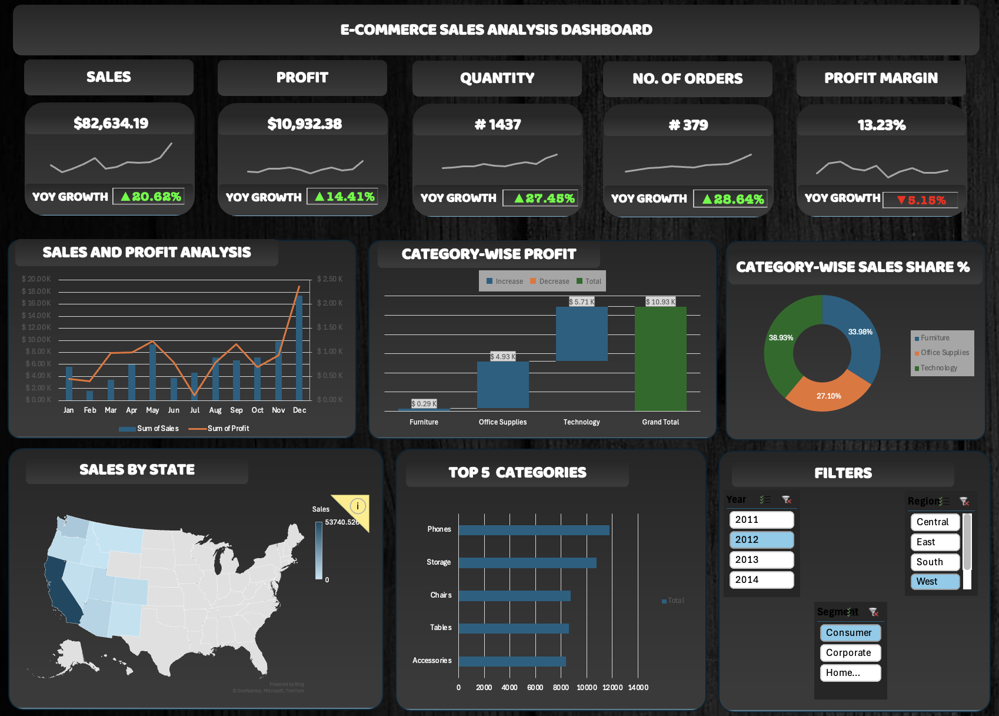

# E-Commerce-Sales
It is a sales analysis dashboard created on MS Excel.
# E-Commerce Sales Analysis Dashboard

A dynamic, interactive Excel dashboard built from scratch to transform raw, unorganized e-commerce transaction data into actionable business intelligence. 

This project focuses heavily on data structuring, backend analytics optimization, and modern UI/UX design within Excel to tell a clear, readable story of retail performance.

---

## 🚀 Key Features & Implementation

*   **Data Cleaning & Structuring:** Processed raw, multi-column e-commerce datasets, ensuring data integrity, correct data types, and eliminating anomalies for accurate analysis.
*   **Backend Analytics:** Built robust Pivot Tables to handle complex aggregations, serving as the foundational engine for all visual reporting.
*   **Custom KPI Cards:** Designed modern, dark-themed metrics cards tracking **Sales, Profit, Quantity, Number of Orders, and Profit Margin**—complete with integrated trend sparklines and automated Year-over-Year (YoY) growth tracking.
*   **Interactive Dynamic Filtering:** Wired up synchronized Slicers allowing end-users to drill down instantly by **Year (2011-2014)**, **Region (Central, East, South, West)**, and **Consumer Segment (Consumer, Corporate, Home Office)**.
*   **Advanced Visualizations:** Integrated geographical mapping (Sales by State), Pareto-style insights (Top 5 Categories), Waterfall analysis (Category-Wise Profit breakdown), and standard monthly trend metrics.

---

## 📊 Business Insights Realized

1.  **Seasonal Trend Mapping:** Identified exact monthly order volume fluctuations, highlighting key high-demand quarters and seasonal purchasing spikes to assist in inventory forecasting.
2.  **Profitability vs. Volume:** Pinpointed product categories that drive actual profit margins versus those that simply generate high sales volume without true bottom-line value.
3.  **Market Segment Dominance:** Tracked regional revenue contribution across different consumer groups to discover geographic strongholds and expansion opportunities.

---

## 🛠️ Tech Stack & Skills Applied

*   **Tool:** Microsoft Excel
*   **Functions & Features:** Power Query/Data Cleaning, Pivot Tables, Pivot Charts, Sparklines, Advanced Conditional Formatting, Geographic Data Mapping.
*   **Design Paradigm:** Dark UI/UX layout focused on executive readability, cognitive load reduction, and seamless dashboard navigation.

---

## 🧠 Reflection & Acknowledgments

This project highlighted that raw numbers are just waiting to be translated into a meaningful narrative. Building this dashboard from the ground up instilled a deep appreciation for intentional data visualization, structured analytical thinking, and the patience required to architect a clean data backend.

Special thanks to the **Analytics and Consulting Club, NIT Rourkela** for pushing me to take on this challenge and providing an incredible environment to learn, build, and apply data analytics skills beyond the standard engineering coursework.

---

## 📂 How to Access the Project

1. Download the `.xlsx` file from this repository.
2. Open it in Microsoft Excel (desktop version recommended for full macro/slicer compatibility).
3. Use the **Filters** panel in the bottom right corner to interactively explore the data!
4.
